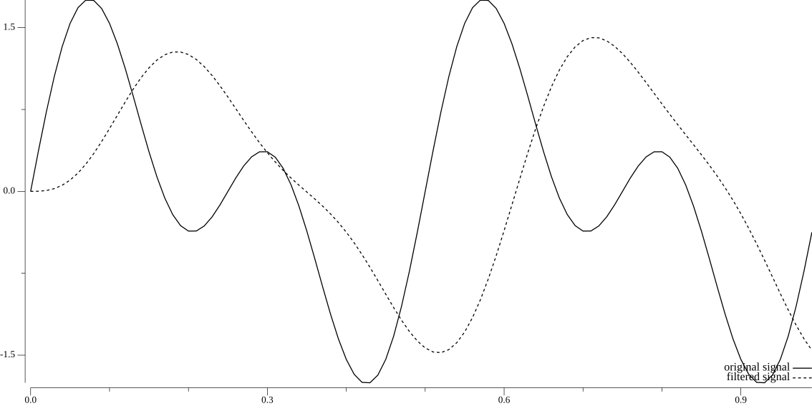
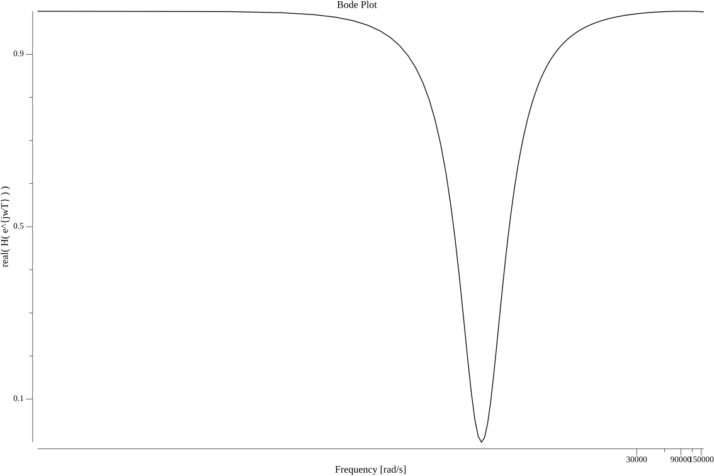

# biquad
Lightweight Bilinear Transform (BLT) filter implementations for DSP in sensor fusion and audio.

Below is an example of usage and the resulting plot:
```go
const (
    pi = math.Pi
    // working frequency. The frequency that matters (we wish to keep it)
    f0     = 2.
    fnoise = 4.
    fs     = 100.   // Sampling frequency.
    N      = 100    // amount of sample points
    ts     = 1 / fs // sampling period
)
// We generate waveform data composed of a "working" frequency and a "noise" frequency
data := make([]float64, N)
for i := 0; i < N; i++ {
    t := float64(i) * ts
    data[i] = math.Sin(2*pi*f0*t) + math.Sin(2*pi*fnoise*t)
}
signal := biquad.MakeSignal(fs, data)
lp, err := biquad.NewLowPass(fs, f0, 1)
if err != nil {
    panic(err)
}

filtered, err := lp.Filter(signal)
if err != nil {
    panic(err)
}
p := plot.New()
ls, _ := plotter.NewLine(signal)
lf, _ := plotter.NewLine(filtered)
lf.Dashes = []font.Length{0.1 * font.Centimeter, 0.1 * font.Centimeter}
p.Add(ls, lf)
p.Legend.Add("original signal", ls)
p.Legend.Add("filtered signal", lf)
err = p.Save(30*font.Centimeter, 15*font.Centimeter, "out.png")
if err != nil {
    panic(err)
}
```

> Low pass filter applied to a composite signal to effectively cancel out the higher frequency noise.


## Bode plots
There is some semblance of a Bode plotter for discrete time (z transfer) functions under `bode.go`. 

This is the result of plotting the Bode of a notch filter:


> Notch filter Bode Plot.

This API is not yet exposed because I'm still unsure of what exactly is being plotted (units). If you're interested please help out! I'll be looking at issues.
Below is the code for the Bode Plot:
```go
const (
    fs = 100.
    ts = 1 / fs
)
lp, err := NewNotch(fs, 4, 1)
if err != nil {
    t.Fatal(err)
}
H := lp.getH()
plotBode("notch_f0=4.png", ts, H)
```